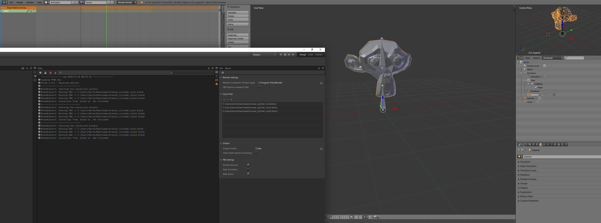

# shiva20blendconvert
Editor module for ShiVa 2.0 which converts .blend files to *.dae or *.fbx, based on "BlendSuite" by [Emmanuel/ShotIris](http://portfolio.shotiris.net).

# Screenshot

# ShiVa Module Installation
For the time being, the module is delivered as separate files. 

## Windows
Copy module/com.tris.blendconvert to AppData/Local/ShiVa/Editor/Modules,  
then put the lua52.dll into the ShiVa 2.0 root directory, next to all the Qt libs

## Mac
Copy module/com.tris.blendconvert to ~/Library/Application Support/ShiVa/Editor/Modules

## Linux
Copy module/com.tris.blendconvert to ~/.shiva/ShiVa/Editor/Modules

# Blender Installation
1. From the File menu, select "User Preferences". Go to the Add-ons page.
2. Select "Install Add-on from File" at the bottom.
3. Select the "BlenderToShiVa_AddOn.py" file and install it.
4. If the new add-on is not displayed after loading it, use the filter field to type "shiva".
5. Tick the box to enable the add-on.
6. Select "Save User Settings" if desired.

# Blender Usage
1. Open the blend file containing the object you want to import into ShiVa.
2. With the Tool Shelf open (T shortcut), there will be a "Misc" tab available.
3. Select the model to be exported (right click the object), then click the "Set for ShiVa button" on the Tool Shelf.
4. The add-on applies a custom property to the object, which you can view on the Object Properties panel if you wish.
5. Save the blend file.

# ShiVa Usage
1. Enter Blender installation path, output directory path and decide whether to use the DAE or FBX pipeline.
2. Add .blend files and run the conversion.
3. Natigate to the export directory.
4. Finish your conversion using one of the following tools: [DaeMassImport](https://github.com/broozar/shiva20daeMassImport) or [FbxImporter](https://github.com/broozar/shiva20fbx).

# Caveats
1. Blender's Collada exporter is best with non-animated models. Results with animation may vary. Use FBX if you rely on animation.
2. If you are experimenting with Collada export and manage to get a model + anim inside ShiVa, but the animation looks completely wrong, inspect your model via Properties->Animation Controller and try setting the animation channel to "None".
3. FBX conversion may rotate Blender-exported FBX skeletons. This can be mitigated on ShiVa DAE import.
4. The BlenderToShiVa addon is used to tag objects inside the Blend file. At this stage, only a single object is acted upon. That is, it finds a model with that tag and exports it. So 1 blend = 1 model for export. This may be updated in the future.
5. The Blender add-on is used to tag a mesh object in Blender. You cannot tag any other kind of object.
6. If animations are to be processed, it is expected that the tagged object is parented to an armature. And as with all Blender->ShiVa model exports, the armature has 0 TRS and all bones are parented to a root bone.
7. It is expected that any Blender file you are trying to process is named with the correct file extension: .blend